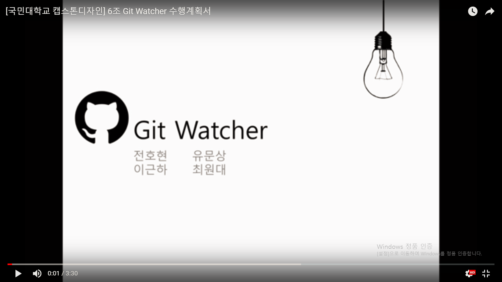
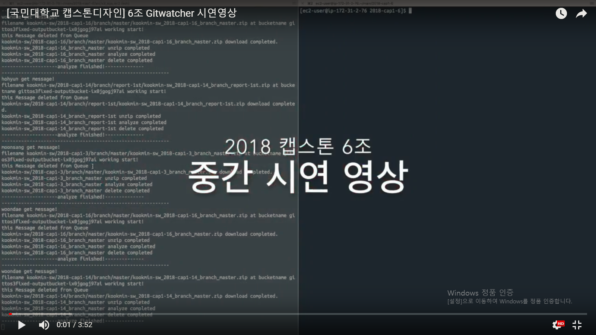

# Git Watcher

### 1. 프로젝트 소개
**Github repository 분석을 통해 사용자의 효율적인 Github 사용을 돕는 서비스.**

규모가 있는 SW 개발을 함에 있어 동일한 프로젝트에 대해 여러 개발자가 동시에 개발할 수 있도록 돕는 버전 관리 시스템을 사용하는 것은 필수적이다. 따라서, 개발자라면 버전 관리 시스템을 효율적으로 사용할 수 있어야 한다. 그렇다면, 기존에 버전 관리 시스템을 사용하여 만든 프로젝트를 분석하여, 그 정보를 제공함으로써 사용자가 버전 관리 시스템을 더 잘 사용할 수 있도록 만들 수 는 없을까?
우리 팀은 버전 관리 시스템 중에서도 가장 보편적으로 쓰이는 GitHub를 활용한 프로젝트를 분석한 정보를 제공함으로써 사용자가 GitHub를 더 효율적으로 사용할 수 있도록 돕는 서비스를 만들고자 한다.

### 2. 팀 소개
 저희 팀은 이경용 교수님과 4명의 학부생으로 이루어져 있습니다.
 
 
 
 지도교수님 : 이경용 교수님
 - 전호현(팀장)
 
 
 ```
 * 학번: 20132926
 * 역할: Git inspector 기능 개선 및 웹 페이지 제작
 * E-mail: jhh5154@naver.com
 ```
 
 - 최원대
 
 
  ```
 * 학번: 20132937
 * 역할: Frontend AWS EC2 Server 담당
 * E-mail: ryunhoo123@gmail.com
 ```
 
 - 유문상
 
 
 ```
 * 학번: 20123075
 * 역할: AWS를 이용한 Back-end 구성(AWS Lambda, S3)
 * E-mail: anstkd07@gmail.com
 ```
 
 - 이근하
 

 ```
 * 학번: 20123079
 * 역할: Git inspector 기능 개선 및 코드 분석 
 * E-mail: ygh1kr@gmail.com
 ```

### 3. Abstract

**This is a service which helps the user use Github's repository efficiently by analyzing it.**

It is essential to use a version control system to develop a scalable software.
Therefor, a software developer has to be knowledgeable and is able to use version control systems
effciently. If so, could we analyze an existing software that uses a version control system and offer
this information to the user for them to be able to use the version control systems better?
Our team focuses on analyzing a software that uses Github, which is the most general version control
system, and we are trying to make web services offer this information to help users use Github more efficiently.

### 4. 소개 영상

 - 수행계획 영상
 
 [](https://youtu.be/QvpxCjbw0fk)
 
 - 중간결과 시연영상
 
 [](https://youtu.be/150V6K1kyL8)

### 5. 결과 영상

추후 업로드 예정
